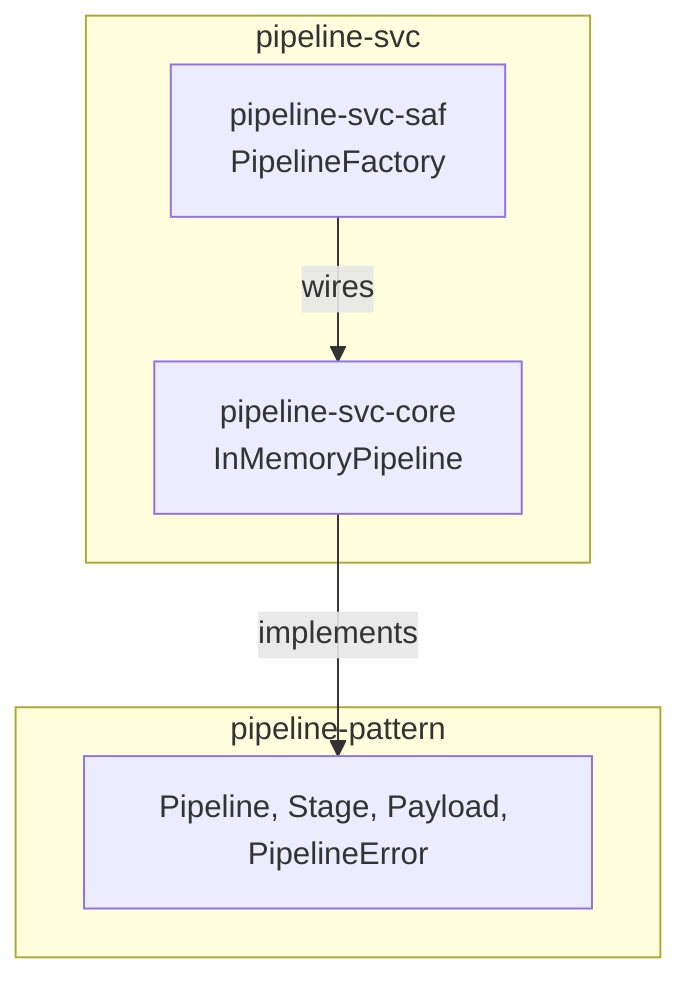

# pipeline-svc Architecture

**Audience**: Architects, technical leads, contributors.

## Overview

Two crates — one `core` reference implementation, one `saf` facade. No
`spi` crate yet:

- **`pipeline-svc-core`** — the technology-free reference implementation:
  `InMemoryPipeline` (runs a fixed, ordered `Vec<Stage>`, no persistence,
  no distributed coordination). See
  [ADR-001](adr/ADR-001-in-memory-reference-implementation.md) for the
  implementation-shape reasoning.
- **`pipeline-svc-saf`** — `PipelineFactory` (`in_memory(stages)`, always
  available — no feature gate, since there's only one backend). A consumer
  depends on `pipeline-pattern` + `pipeline-svc-saf` alone.

## `Pipeline` is object-safe — like `Scheduler`, unlike `executor-pattern`'s `Executor`

`Pipeline::run` has no generic parameters, so `Pipeline` is fully
object-safe: `Box<dyn Pipeline>` exists. `PipelineFactory::in_memory()`
returns `Box<dyn Pipeline>` uniformly, matching `message-broker-svc-saf`'s
`MessageBrokerFactory`/`scheduler-svc-saf`'s `SchedulerFactory` shape —
unlike `executor-svc-saf`'s `ExecutorFactory`, which must return `impl
Executor` per constructor because `Executor::run<F: Future>` is generic.
Worth stating explicitly: these are sibling `-svc` repos in this org with
genuinely different object-safety constraints, not an inconsistency to
"fix" toward matching each other.

## Component Diagram

## Why `PipelineFactory::in_memory` takes `stages`, unlike `SchedulerFactory`/`TransactionalStoreFactory`'s parameterless `in_memory()`

A scheduler or a key-value store both have a sensible empty starting
state (no jobs scheduled yet, no records written yet) — state accumulates
through later calls (`schedule`, `put`). A pipeline has no equivalent
"empty but usable" state: it exists entirely to run a specific,
pre-configured sequence of stages, so those stages are a construction-time
requirement, not something added afterward one call at a time.

## Why no `spi` crate yet

No real consumer has needed a distributed or external-workflow-engine
pipeline backend (Temporal, Airflow, Kafka Streams). Per this org's own
`<domain>-<technology>-spi` convention, an `spi` crate wraps exactly one
external technology — building one speculatively, with no real technology
chosen and no real consumer validating the choice, would be the same
premature-generalization mistake `pipeline-pattern`'s own ADR-001 declined
to make for branching/DAG support. Add one when a real need does.

## Scope boundary

This repo implements exactly `pipeline-pattern`'s `Pipeline` trait, one
backend. Not covered, deliberately:

- **Distributed/external-engine backends** — no `spi` crate yet, see
  above.
- **Branching/conditional pipelines (DAG), a short-circuit-without-
  erroring signal, per-stage retries** — all out of scope at the contract
  level too; see `pipeline-pattern`'s own architecture.md Scope boundary
  section. This repo cannot implement what the contract doesn't define.

[← Docs index](../README.md)
